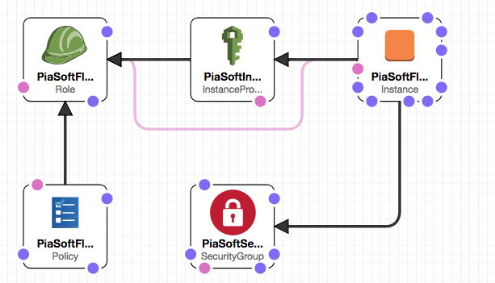

# cloudformation
AWS Cloud Formation templates to start the Pia Software Flow Logs Viewer

https://aws.amazon.com/marketplace/pp/B074N3YQ1P

## Purpose

These will:
* Create the IAM User needed for the flow logs viewer
* Create an access key for that user
* Create an outputs block for that access key, and put the Access and Secret Key in CloudFormation's outputs.

## Resource Diagram

